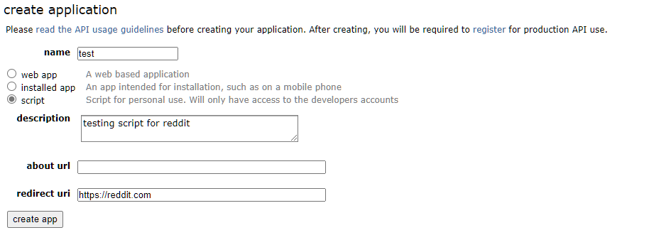
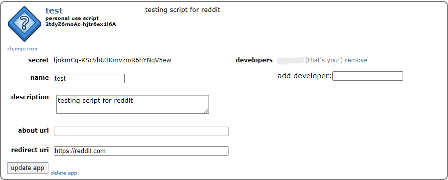

# Reddit Account Mover

This script allows you to move your Reddit account subscriptions from one account to another. Currently, the script requires some setup, but I plan to turn it into a web app in the future to make things simpler.

# Requirements

- [Node and npm](https://nodejs.org/en/) must be installed on your computer.

- [Git](https://github.com/git-guides/install-git) must be installed on your computer.

# Setup

1. Click on `create app` at the bottom of https://www.reddit.com/prefs/apps. Fill in the form with the following information, making sure to select script as the app type.



2. Click on `create app` once more, and you should see this:



On this page, you will need two codes: the client secret and the client ID. The client ID is located just below the text "personal use script," and the client secret is next to the text "secret." Copy these for later use.

3. Open a terminal and enter the following commands:

```bash
git clone https://github.com/ypatel2022/reddit-account-mover
cd reddit-account-mover
```

4. Install the required dependencies using the command:

```bash
npm i
```

5. Create an environment variable file using the command:

```bash
touch .env
```

6. Open the `.env` file for editing and add the following code, replacing items in "<>" with your own information:

```
USER_AGENT=redditAccount script by u/<username>
CLIENT_ID=<your client id>
CLIENT_SECRET=<your client secret>
NEW_USERNAME=<username of account to move to>
NEW_PASSWORD=<password of account to move to>
SOURCE_USERNAME=<username of account you are moving from>
SOURCE_PASSWORD=<password of account you are moving from>
```

7. To move all of your subreddit subscriptions to the new account, use the following command:

```bash
node index.js
```

As the script runs, it will print the names of the subreddits as they are subscribed to.

Happy Reddit-ing! 🚀🚀🚀
